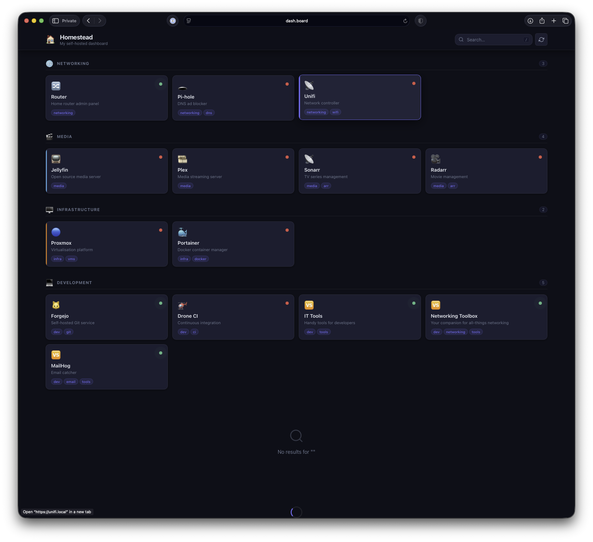
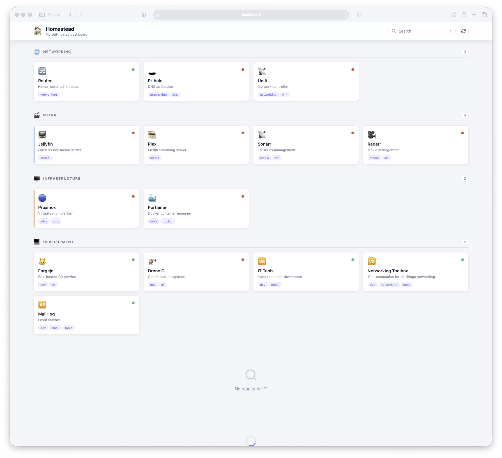

# Homestead

A lightweight, self-hosted personal dashboard for monitoring and accessing your home lab services. Built with Go and vanilla JavaScript — no framework dependencies, no bloat.

[](https://github.com/haydenk/homestead/actions/workflows/ci.yml)
[](https://github.com/haydenk/homestead/releases/latest)
[](https://goreportcard.com/report/github.com/haydenk/homestead)
[](https://github.com/haydenk/homestead/pkgs/container/homestead)


## Preview

| Dark | Light |
|------|-------|
|  |  |

## Features

- **Service Dashboard** — Centralized hub for all your self-hosted applications organized into sections
- **Real-time Health Checks** — Background HTTP/HTTPS status monitoring with configurable intervals
- **Search & Filter** — Full-text search across service titles, descriptions, and tags (`/` or `Ctrl+K`)
- **Keyboard Shortcuts** — `/` or `Ctrl+K` to search, `R` to refresh, `Esc` to close
- **Light / Dark Theme** — Automatic or explicit theme selection with custom accent colors per card
- **Live Config Reload** — Reload configuration without restarting via `POST /api/reload`
- **Minimal Footprint** — Single binary, ~1,000 lines of code, one external Go dependency

## Installation

### From source

```bash
git clone https://github.com/haydenk/homestead.git
cd homestead
go build -o homestead .
./homestead -config config.toml
```

### Docker

```bash
docker build -t homestead .

docker run -d \
  --name homestead \
  -p 8080:8080 \
  -v $(pwd)/config.toml:/app/config/config.toml \
  homestead
```

### System package (deb / rpm / apk)

Build packages with [nfpm](https://nfpm.goreleaser.com/):

```bash
nfpm package
```

The package:
- Installs the binary to `/usr/bin/homestead`
- Places the config at `/etc/homestead/config.toml`
- Registers and enables a hardened systemd service running as a non-root `homestead` user

```bash
systemctl enable --now homestead
```

## Configuration

Homestead is configured via a TOML file. Copy the included `config.toml` and edit to suit your setup.

```toml
title          = "Homestead"
subtitle       = "My self-hosted dashboard"
logo           = "🏠"
columns        = 4      # cards per row (1–6)
check_interval = 30     # seconds between health checks
footer         = "Running on Proxmox"
theme          = "dark" # "dark" | "light" | omit for system default

[[sections]]
name = "Media"
icon = "🎬"

  [[sections.items]]
  title        = "Jellyfin"
  url          = "https://jellyfin.lan"
  description  = "Media server"
  icon         = "🎞️"        # emoji or image URL
  tags         = ["media", "streaming"]
  status_check = true        # enable health monitoring
  color        = "#00a4dc"   # accent color (hex)
  target       = "_blank"    # "_blank" | "_self"

  [[sections.items]]
  title        = "Sonarr"
  url          = "https://sonarr.lan"
  description  = "TV show management"
  icon         = "📺"
  tags         = ["media", "automation"]
  status_check = true
```

### Health check behavior

- Uses a `HEAD` request first; falls back to `GET` if the server returns `405 Method Not Allowed`
- Any response with `statusCode < 500` is considered **up** (including auth-protected endpoints)
- Self-signed certificates are accepted
- Request timeout: 10 seconds

## Runtime options

Configuration can be overridden via flags or environment variables:

| Flag | Env var | Default | Description |
|------|---------|---------|-------------|
| `-config` | `HOMESTEAD_CONFIG` | `config.toml` | Path to config file |
| `-host` | `HOMESTEAD_HOST` | `127.0.0.1` | Bind address |
| `-port` | `HOMESTEAD_PORT` | `8080` | Listen port |

```bash
# Using flags
./homestead -host 0.0.0.0 -port 9000 -config /etc/homestead/config.toml

# Using environment variables
HOMESTEAD_HOST=0.0.0.0 HOMESTEAD_PORT=9000 ./homestead
```

## API

| Method | Path | Description |
|--------|------|-------------|
| `GET` | `/` | Web UI |
| `GET` | `/api/config` | Full configuration as JSON |
| `GET` | `/api/status` | Health check statuses for all items |
| `GET` | `/api/status/{id}` | Health check status for a single item |
| `POST` | `/api/reload` | Reload config from disk and restart checks |
| `GET` | `/api/health` | Health probe (`{"status":"ok","time":"..."}`) |

**Status response example:**

```json
{
  "id": "s0-i0",
  "url": "https://jellyfin.lan",
  "up": true,
  "statusCode": 200,
  "responseTimeMs": 145,
  "lastChecked": "2024-02-24T16:30:00Z",
  "error": ""
}
```

## Development

Requirements: Go 1.22+. Tool versions are managed via [mise](https://mise.jdx.dev/) (`.mise.toml`).

```bash
# Install tools
mise install

# Run locally
go run . -config config.toml -host 0.0.0.0

# Format
go fmt ./...
```

A VS Code dev container is included (`.devcontainer/`) with Go, mise, and the TOML formatter pre-configured.

## Project structure

```
.
├── main.go                     # Entry point, flag parsing, graceful shutdown
├── config.toml                 # Example configuration
├── Dockerfile                  # Multi-stage build (golang:1.22-alpine → alpine:3.19)
├── homestead.service           # systemd unit file
├── nfpm.yaml                   # Package build config (deb, rpm, apk)
├── internal/
│   ├── config/config.go        # TOML config structs and loader
│   ├── checker/checker.go      # Background health check engine
│   └── server/
│       ├── server.go           # HTTP server setup and routing
│       └── handlers.go         # API handler implementations
└── web/
    ├── index.html              # UI template
    ├── app.js                  # Frontend logic (vanilla JS)
    └── style.css               # Styles with light/dark theme support
```

## Tech stack

- **Backend:** Go standard library + [`BurntSushi/toml`](https://github.com/BurntSushi/toml)
- **Frontend:** HTML5, vanilla JavaScript (ES2020+), CSS3 custom properties
- **Packaging:** Docker (Alpine), systemd, nfpm (deb/rpm/apk)

## License

GPL-3.0. See `LICENSE`.
